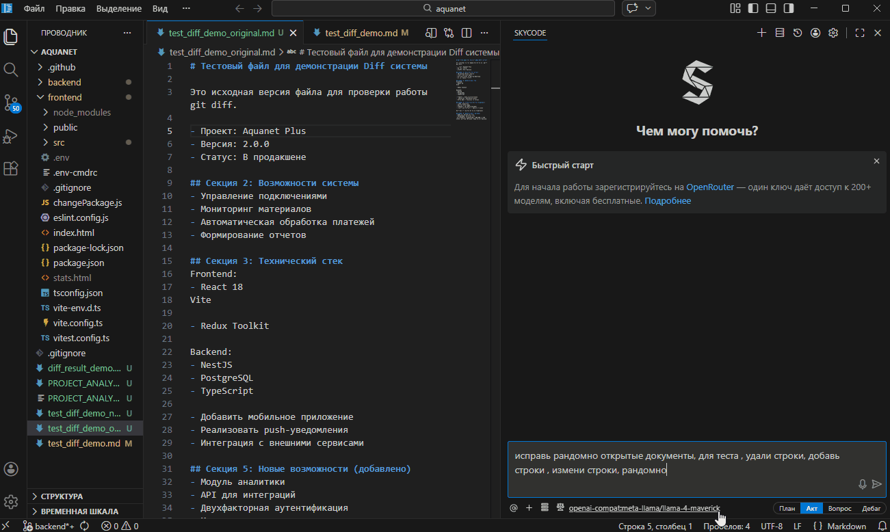

# Skycode AI

**AI-powered code editor built on VS Code — open-source alternative to Cursor**

Skycode is a fork of VS Code with a deeply integrated AI agent. Unlike extensions (Copilot, Continue, etc.), the AI is part of the editor itself — giving full control over UX, performance, and security.

<p align="center">
  
</p>

---

## Features

### AI Agent with 30+ Tools

| Capability | Description |
|-----------|-------------|
| **Read & edit files** | Full file creation, block replacement, patches |
| **Execute commands** | Terminal: build, test, git, npm, Docker |
| **Semantic search** | Search by meaning across the entire codebase (local embeddings) |
| **Regex search** | Fast pattern matching via ripgrep |
| **Web search** | Search the internet for information |
| **Browser automation** | Puppeteer: screenshots, clicks, form filling |
| **MCP integrations** | Connect external services (Context7, databases, APIs) |
| **Diagnostics** | Read ESLint, TypeScript, and other linter errors |
| **Jupyter Notebooks** | Create and edit notebook cells |

### 4 Operating Modes

| Mode | Purpose |
|------|---------|
| **Act** | Default. Full tool access, code modification |
| **Plan** | Design approach. Read-only, no code changes |
| **Debug** | Systematic debugging with runtime evidence |
| **Ask** | Q&A. Explore codebase without modifications |

The agent can dynamically switch between modes during a conversation.

### Inline Diff System v4

- Changes from AI displayed **directly in the editor** (green = added, red = removed)
- **Accept / Reject** buttons per change block
- Per-message snapshots for precise rollback
- Cross-file navigation between pending changes
- 217 unit tests covering the entire diff engine

### Semantic Code Search

- **Local embedding index** of the entire project (transformers.js, WASM, offline)
- Hybrid retrieval: semantic + keyword + rerank
- Incremental updates via FileWatcher
- Optional remote API (OpenAI-compatible)

### 40+ API Providers

- **OpenAI** — GPT-4o, o1, o3
- **Anthropic** — Claude Sonnet, Opus, Haiku
- **Google** — Gemini 2.5 Pro/Flash
- **GigaChat** — native function calls (Sber)
- **YandexGPT** — YandexGPT 5 Pro/Lite
- **Open-source** — Qwen, DeepSeek, Llama, Mistral
- **OpenRouter** — 200+ models aggregator
- Any **OpenAI-compatible** API (Ollama, LM Studio, vLLM)

### Voice Input

Offline speech recognition (Whisper, 50+ languages). No internet required.

### Lightweight Mode

Simplified prompts and tools for weaker/free models. 11 prompt variants optimized for specific model families.

---

## Quick Start

```bash
# Clone
git clone https://github.com/RuslanSinkevich/skycode.git
cd skycode

# Install
npm install

# Launch (development mode)
# Windows:
.\scripts\code.bat
# macOS/Linux:
./scripts/code.sh
```

### Building the Extension

```bash
cd extensions/skycode/webview-ui
npm run build          # UI

cd ..
node esbuild.mjs      # Backend
```

Open the Skycode panel in the sidebar → configure your API provider → start coding.

---

## Architecture

```
┌──────────────────────────────────────────────┐
│  VS Code Fork                                 │
│  ┌──────────────────────────────────────┐    │
│  │  Skycode Extension                    │    │
│  │  ┌────────┐ ┌──────┐ ┌───────────┐  │    │
│  │  │ Agent  │ │ Diff │ │ Indexing  │  │    │
│  │  │ Loop   │ │ v4   │ │ (SQLite)  │  │    │
│  │  └───┬────┘ └──────┘ └───────────┘  │    │
│  │      ↓                               │    │
│  │  ┌────────┐ ┌──────┐ ┌───────────┐  │    │
│  │  │ 40+   │ │ MCP  │ │ Prompts   │  │    │
│  │  │ APIs  │ │ Hub  │ │ Engine    │  │    │
│  │  └────────┘ └──────┘ └───────────┘  │    │
│  └──────────────────────────────────────┘    │
│                    ↕ gRPC                     │
│  ┌──────────────────────────────────────┐    │
│  │  Webview UI (React, 230+ components) │    │
│  └──────────────────────────────────────┘    │
└──────────────────────────────────────────────┘
```

| Component | Technology |
|-----------|-----------|
| Editor | VS Code fork |
| Communication | gRPC + Protobuf |
| Chat UI | React (230+ components) |
| Code parsing | Tree-sitter (16 languages) |
| Search | Embedding index + ripgrep |
| Analytics | PostHog + OpenTelemetry (opt-in) |

---

## Documentation

### Architecture
- [Overview](./docs/skycode/architecture/overview.md)
- [Core Module](./docs/skycode/architecture/core.md)
- [Context Management](./docs/skycode/architecture/context-management.md)

### Systems
- [Inline Diff System v4](./docs/skycode/systems/diff-system.md)
- [Codebase Indexing](./docs/skycode/systems/indexing-system.md)
- [MCP Integration](./docs/skycode/systems/mcp.md)

### Development
- [Getting Started](./docs/skycode/development/getting-started.md)
- [Adding Agent Tools](./docs/skycode/development/adding-tools.md)
- [Network Requests](./docs/skycode/development/network.md)
- [Adding Settings](./docs/skycode/development/adding-settings.md)
- [VS Code Fork Patches](./docs/skycode/development/fork-patches.md)

---

## Contributing

See [CONTRIBUTING.md](./CONTRIBUTING.md) for development setup, code style, and PR guidelines.

---

## Acknowledgments

Skycode is built upon several open-source projects:

- [VS Code](https://github.com/microsoft/vscode) (MIT) — the editor foundation
- [Cline](https://github.com/cline/cline) (Apache 2.0) — initial extension architecture
- [Continue](https://github.com/continuedev/continue) (Apache 2.0) — local embedding pipeline
- [Kilocode](https://github.com/Kilo-Org/kilocode) (Apache 2.0 / MIT) — tool handling patterns

See [THIRD_PARTY_NOTICES.md](./THIRD_PARTY_NOTICES.md) for full attribution.

## License

[Apache License 2.0](./LICENSE)
