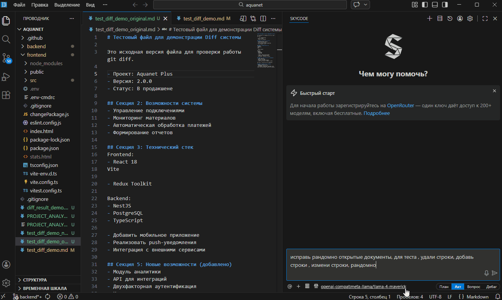

# Skycode AI

> English version: [README.en.md](README.en.md)

**AI-редактор кода на основе VS Code — открытая альтернатива Cursor**

Skycode — форк VS Code с глубоко встроенным AI-агентом. В отличие от расширений (Copilot, Continue и др.), AI здесь часть самого редактора — это даёт полный контроль над UX, производительностью и безопасностью.

<p align="center">
  
</p>

<p align="center">
  <a href="https://ruslansinkevich.ru/#skycode">Сайт</a> ·
  <a href="#документация">Документация</a> ·
  <a href="./README.en.md">English</a> ·
  <a href="https://github.com/RuslanSinkevich/skycode">GitHub</a>
</p>

---

## Возможности

### AI-агент с 30+ инструментами

| Возможность | Описание |
|-----------|-------------|
| **Чтение и правка файлов** | Создание файлов, замена блоков, патчи |
| **Выполнение команд** | Терминал: сборка, тесты, git, npm, Docker |
| **Семантический поиск** | Поиск по смыслу по всей кодовой базе (локальные embeddings) |
| **Поиск по regex** | Быстрый поиск по шаблону через ripgrep |
| **Веб-поиск** | Поиск информации в интернете |
| **Автоматизация браузера** | Puppeteer: скриншоты, клики, заполнение форм |
| **MCP-интеграции** | Подключение внешних сервисов (Context7, базы данных, API) |
| **Диагностика** | Чтение ошибок ESLint, TypeScript и других линтеров |
| **Jupyter Notebooks** | Создание и редактирование ячеек |

### 5 режимов работы

| Режим | Назначение | Инструменты |
|------|---------|-------|
| **Act** | По умолчанию. Выполнение задач, правка файлов, запуск команд | Все |
| **Ask** | Изучение кода, ответы на вопросы | Только чтение |
| **Plan** | Сбор информации, проектирование решения | Только чтение + `plan_mode_respond` |
| **Debug** | Систематическая отладка на реальных данных выполнения | Только чтение + `execute_command` |
| **Chat** | Обычный разговор на любую тему | Только чтение (по явной просьбе) |

Агент может сам переключаться между режимами по ходу разговора.

### Inline Diff System v4

- Изменения от AI показываются **прямо в редакторе** (зелёное — добавлено, красное — удалено)
- Кнопки **Принять / Отклонить** для каждого блока изменений
- Снимки состояния на каждое сообщение для точного отката
- Навигация между ожидающими изменениями в разных файлах
- 217 unit-тестов покрывают весь diff-движок

### Семантический поиск по коду

- **Локальный индекс embeddings** по всему проекту (transformers.js, WASM, без интернета)
- Гибридный поиск: семантический + по ключевым словам + переранжирование
- Инкрементальное обновление через FileWatcher
- Опционально — удалённый API (OpenAI-совместимый)

### 40+ API-провайдеров

- **OpenAI** — GPT-4o, o1, o3
- **Anthropic** — Claude Sonnet, Opus, Haiku
- **Google** — Gemini 2.5 Pro/Flash
- **GigaChat** — нативные function calls (Сбер)
- **YandexGPT** — YandexGPT 5 Pro/Lite
- **Open-source** — Qwen, DeepSeek, Llama, Mistral
- **OpenRouter** — агрегатор 200+ моделей
- Любой **OpenAI-совместимый** API (Ollama, LM Studio, vLLM)

### Голосовой ввод

Офлайн-распознавание речи (Whisper, 50+ языков). Интернет не нужен.

### Облегчённый режим

Упрощённые промпты и инструменты для слабых и бесплатных моделей. 11 вариантов промптов, оптимизированных под конкретные семейства моделей.

---

## Быстрый старт

```bash
# Клонировать
git clone https://github.com/RuslanSinkevich/skycode.git
cd skycode

# Установить зависимости
npm install

# Запуск (режим разработки)
# Windows:
.\scripts\code.bat
# macOS/Linux:
./scripts/code.sh
```

### Сборка расширения

```bash
cd extensions/skycode/webview-ui
npm run build          # UI

cd ..
node esbuild.mjs      # Бэкенд
```

Откройте панель Skycode на боковой панели → настройте API-провайдера → начинайте работать.

---

## Архитектура

```
┌──────────────────────────────────────────────┐
│  VS Code Fork                                 │
│  ┌──────────────────────────────────────┐    │
│  │  Skycode Extension                    │    │
│  │  ┌────────┐ ┌──────┐ ┌───────────┐  │    │
│  │  │ Agent  │ │ Diff │ │ Indexing  │  │    │
│  │  │ Loop   │ │ v4   │ │ (SQLite)  │  │    │
│  │  └───┬────┘ └──────┘ └───────────┘  │    │
│  │      ↓                               │    │
│  │  ┌────────┐ ┌──────┐ ┌───────────┐  │    │
│  │  │ 40+   │ │ MCP  │ │ Prompts   │  │    │
│  │  │ APIs  │ │ Hub  │ │ Engine    │  │    │
│  │  └────────┘ └──────┘ └───────────┘  │    │
│  └──────────────────────────────────────┘    │
│                    ↕ gRPC                     │
│  ┌──────────────────────────────────────┐    │
│  │  Webview UI (React, 230+ components) │    │
│  └──────────────────────────────────────┘    │
└──────────────────────────────────────────────┘
```

| Компонент | Технология |
|-----------|-----------|
| Редактор | Форк VS Code |
| Связь | gRPC + Protobuf |
| UI чата | React (230+ компонентов) |
| Разбор кода | Tree-sitter (16 языков) |
| Поиск | Индекс embeddings + ripgrep |
| Аналитика | PostHog + OpenTelemetry (только с согласия) |

---

## Документация

> **English documentation:** [docs/skycode/en/](./docs/skycode/en/architecture/overview.md)

### Архитектура
- [Обзор архитектуры](./docs/skycode/architecture/overview.md)
- [Модуль Core](./docs/skycode/architecture/core.md)
- [Управление контекстом](./docs/skycode/architecture/context-management.md)

### Системы
- [Inline Diff System v4](./docs/skycode/systems/diff-system.md)
- [Индексация кодовой базы](./docs/skycode/systems/indexing-system.md)
- [Интеграция MCP](./docs/skycode/systems/mcp.md)

### Разработка
- [Руководство по разработке](./docs/skycode/development/getting-started.md)
- [Добавление инструментов агента](./docs/skycode/development/adding-tools.md)
- [Сетевые запросы и прокси](./docs/skycode/development/network.md)
- [Добавление настроек](./docs/skycode/development/adding-settings.md)
- [Патчи форка VS Code](./docs/skycode/development/fork-patches.md)

---

## Участие в разработке

Настройка окружения, стиль кода и правила PR — в [CONTRIBUTING.md](./CONTRIBUTING.md).

---

## Благодарности

Skycode построен на нескольких open-source проектах:

- [VS Code](https://github.com/microsoft/vscode) (MIT) — основа редактора
- [Cline](https://github.com/cline/cline) (Apache 2.0) — исходная архитектура расширения
- [Continue](https://github.com/continuedev/continue) (Apache 2.0) — локальный pipeline embeddings
- [Kilocode](https://github.com/Kilo-Org/kilocode) (Apache 2.0 / MIT) — паттерны работы с инструментами

Полный список — в [THIRD_PARTY_NOTICES.md](./THIRD_PARTY_NOTICES.md).

## Лицензия

[Apache License 2.0](./LICENSE)
